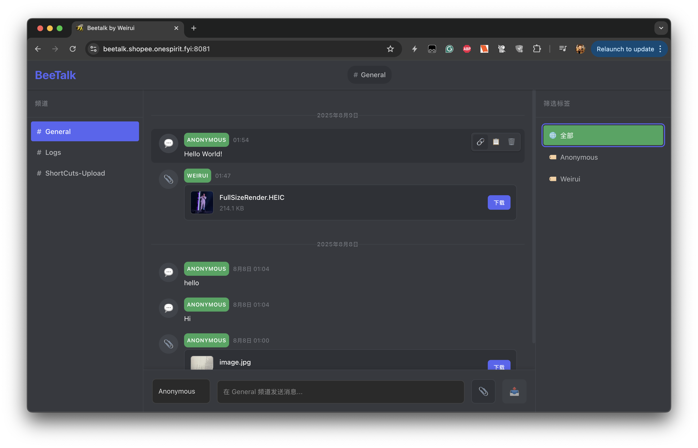

# BeeTalk

BeeTalk是一个轻量的、无验证的Web聊天室和文件分享中心。可以方便发送消息以及共享文件。

BeeTalk is a lightweight, authentication-free web chat room and file sharing center. It allows easy messaging and file sharing.


## 功能特性 / Features

- 💬 实时聊天功能 / Real-time chat functionality
- 📁 文件上传和分享 / File upload and sharing
- 🎥 视频缩略图生成 / Video thumbnail generation
- 📱 响应式设计 / Responsive design
- 🔒 简单易用的界面 / Simple and user-friendly interface

## 系统要求 / System Requirements

在运行BeeTalk之前，请确保您的系统已安装以下必要环境：

Before running BeeTalk, please ensure your system has the following necessary environments installed:

- **Node.js** (推荐 v16 或更高版本 / Recommended v16 or higher)
- **FFmpeg** (用于视频缩略图生成 / For video thumbnail generation)
- **npm**

## 快速开始 / Quick Start

### 1. 克隆项目 / Clone the project

```bash
git clone <repository-url>
cd BeeTalk
```

### 2. 安装依赖 / Install dependencies

```bash
# 安装服务器端依赖 / Install server dependencies
cd BeeTalkServer
npm install

# 安装客户端依赖 / Install client dependencies
cd ../BeeTalkWeb
npm install
```

### 3. 配置环境 / Configure environment

- 设置您的域名 / Set your domain name
- 配置SSL证书（推荐用于生产环境）/ Configure SSL certificates (recommended for production)
- 根据需要调整配置文件 / Adjust configuration files as needed

### 4. 启动服务器 / Start the server

```bash
# 在项目根目录运行 / Run in project root directory
./start-server.sh
```

或者手动启动 / Or start manually:

```bash
# 启动服务器 / Start server
cd BeeTalkServer
npm start

# 启动客户端（新终端）/ Start client (new terminal)
cd BeeTalkWeb
npm run dev
```

## 项目结构 / Project Structure

```
BeeTalk/
├── BeeTalkServer/     # 服务器端代码 / Server-side code
│   ├── certs/        # SSL证书 / SSL certificates
│   ├── public/       # 静态文件 / Static files
│   ├── src/          # 服务器源码 / Server source code
│   └── uploads/      # 文件上传目录 / File upload directory
├── BeeTalkWeb/       # 客户端代码 / Client-side code
│   ├── src/          # React源码 / React source code
└── start-server.sh   # 启动脚本 / Startup script
```

## 安全注意事项 / Security Considerations

⚠️ **重要提醒 / Important Notice**：

- BeeTalk旨在运行在一个可信任的环境，如公司内网或家庭局域网
  BeeTalk is designed to run in a trusted environment, such as corporate intranet or home LAN

- 如需在公网使用，建议自行添加HTTP Basic Auth或其他认证机制
  If you need to use it on the public internet, it's recommended to add HTTP Basic Auth or other authentication mechanisms

## 自定义配置 / Custom Configuration

您可以根据需要修改以下配置：

You can modify the following configurations as needed:

- 服务器端口设置 / Server port settings
- 文件上传大小限制 / File upload size limits
- SSL证书配置 / SSL certificate configuration
- 域名设置 / Domain name settings

## 故障排除 / Troubleshooting

如果遇到问题，请检查：

If you encounter issues, please check:

1. Node.js版本是否符合要求 / Whether Node.js version meets requirements
2. FFmpeg是否正确安装 / Whether FFmpeg is properly installed
3. 端口是否被占用 / Whether ports are occupied
4. 防火墙设置 / Firewall settings

## 贡献 / Contributing

欢迎提交Issue和Pull Request来改进BeeTalk！

Welcome to submit Issues and Pull Requests to improve BeeTalk!

## 许可证 / License

MIT License.